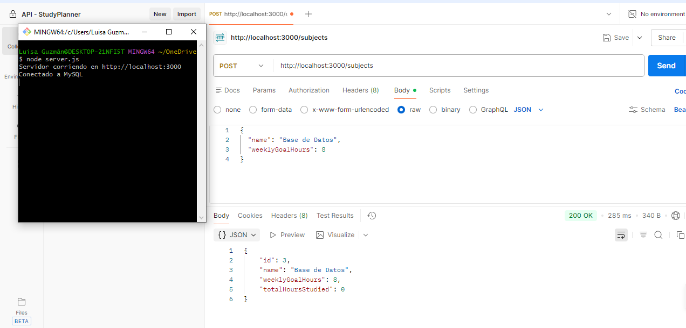
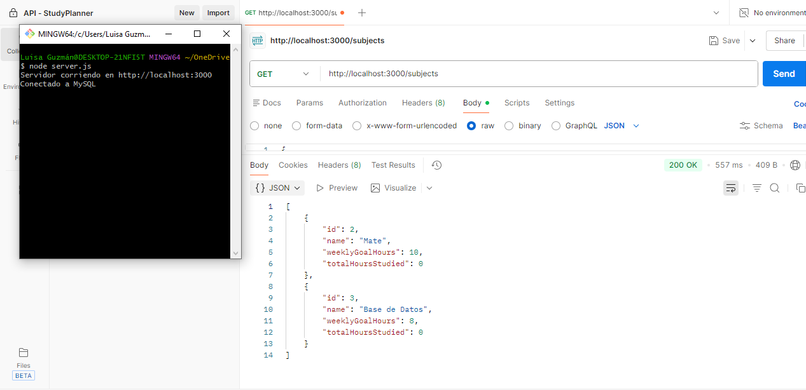
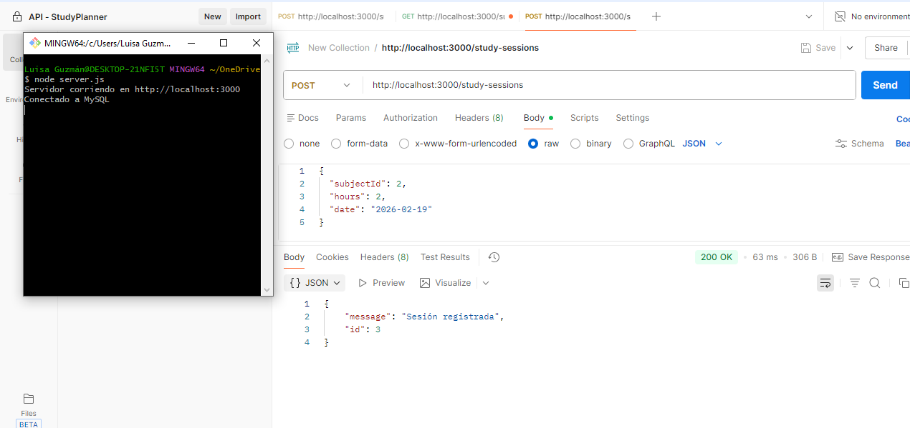
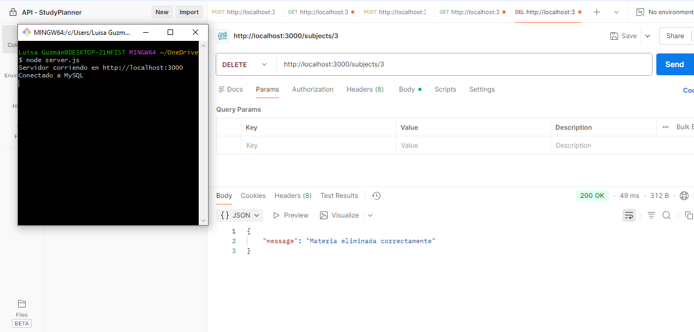

**Tecnologias Usadas para esta API:**
        + Node.js
        + Express.js
        + JavaScript (Fetch API)
        + HTML + Bootstrap
        + MySql
        + NPM

**CREAR LA BASE DE DATOS**
    Para esta API, se usó como motor de DB MySQL, ejecuta este código en el entorno de MySQL para crear las tablas
CREATE DATABASE studyplanner;

USE studyplanner;

CREATE TABLE subjects (
    id INT AUTO_INCREMENT PRIMARY KEY,
    name VARCHAR(100) NOT NULL,
    weeklyGoalHours INT NOT NULL,
    totalHoursStudied INT DEFAULT 0
);

CREATE TABLE study_sessions (
    id INT AUTO_INCREMENT PRIMARY KEY,
    subjectId INT,
    hours INT,
    date DATE,
    FOREIGN KEY (subjectId) REFERENCES subjects(id)
);

        
**CONEXIÓN A LA DB**
    Para este proyecto se utilizan variables de entorno para proteger la información sensible.
    En la raíz del proyecto debe existir un archivo .env, este no se envía con el proyecto por cuestiones
    de seguridad y buenas prácticas.
    Crea el archivo .env en la raíz y agrega la siguiente información:

    DB_HOST=localhost
    DB_USER=root
    DB_PASSWORD=tu_password
    DB_NAME=studyplanner
    DB_PORT=3306

**INSTALACIÓN DE DEPENDENCIAS**
    + Express.js para crear el servidor
    + mysql2 para conexión a base de datos
    + cors para permitir peticiones desde el frontend
    + Usaremos el paquete dotenv para la conexión a la DB

    Se instala con el siguiente código:
        npm install

**EJECUTA EL SERVIDOR**
    Cuándo tenga todo instalado, ejecuta el servidor en la consola con el siguiente código:
    node server.js

    Se abrirá en el navegador una ventana
        http://localhost:3000

**RESPUESTA A LAS PREGUNTAS DEL DOCUMENTO "ACTIVIDAD"**
1. ¿Qué es StudyPlanner AI?
    Es una API REST diseñada para ayudar a los estudiantes a organizar sus sesiones de estudio o tareas, registrar
    avances y gestionar metas acadÍmicas de forma estructurada.
    
    PERMITE:
        + Crear planes de estudio
        + Registrar materias / Tareas
        + Registrar sesiones de estudio
        + Consultar progresos
        + Eliminar materia/tarea

2. ¿Por qué elegÍ esta API?:
    Elegí esta API, porque es bien sabido que a los estudiantes de hoy día (incluyendome) se nos complica mucho 
    llevar un orden y seguimiento de las actividades por realizar, nuestro mayor inconveniente es la mala
    gestión de tiempos y progresos. Por lo tanto, está API esta diseñada para ayudar a gestionar la organización
    académica.
3. ¿Qué problema busca solucionar?
    Como ya mencione, a muchos estudiantes se nos complica el aprendizaje por la mala gestión de las actividades,
    el tiempo y/o progresos. por lo tanto busca solucionar ese desorden, ayuda a visualizar las horas dedicadas por 
    materias y/o actividad, establece metas semanales, lo que ayuda para muchos estudiantes a tener una motivación
    extra para cumplir con sus objetivos y los ayuda a llevar un progreso, permitiendo así mejor claridad sobre lo
    que ha aprendido evitando así la traba de no saber qué hacer o si lo está haciendo bien.
4. ¿Es viable su implementación?
    Si, totalmente viable, es un API sencilla, con operaciones estándar, lo que hace que su implementación y desarrollo
    sea sencillo y sea escalable, además de que cualquier persona con conocimientos básicos en desarrollo web la pueda
    implementar y el usó de la misma es sencillo, lo que hace que sea una herramienta útil para cualquier estudiante.

5. *CREACION DE LOS ENDPOINTS*
        **CREAR MATERIA/TAREAS**
        
        Ruta: POST URL/subjects
        POST: Permite crear una materia tarea con una meta semanal de horas
        PARÁMETROS:{
                        "name": "JavaScript",
                        "weeklyGoalHours": 10
                    }
        **OBTENER TODAS LAS MATERIAS/TAREAS**
        
        RUTA: GET URL/subjects
        GET: Obtiene una lista de todas las materias registradas. 
        NO REQUIERE PARÁMETROS
        **REGISTRAR SESIÓN DE ESTUDIO**
        
        RUTA: POST URL/study-sessions
        POST: Permite registrar horas de estudio para una materia especifica.
        PARÁMETROS: {
                        "subjectId": 1,
                        "hours": 2,
                        "date": "2026-02-19"
                    }
        **OBTENER PROGRESO DE UNA MATERIA/TAREA**
        
        RUTA: GET URL/subjects/:id/progress
        GET: Obtiene el porcentaje de progreso respecto a la meta semanal
        PARÁMETROS: Este se agrega en el PATH de la url -> subjects/2/progress
        **ELIMINAR MATERIA**
        
        RUTA: DELETE URL/subjects/:id
        DELETE: Elimina una materia y sus sesiones asociadas
        PARÁMETROS: Se agrega en el PATH de la url -> subjects/3

6. USÓ DE FETCH
    Los endpoints diseñados para la StudyPlanner API fueron consumidos desde el frontend utilizando la función fetch() de JavaScript.
    Fetch es una API nativa del navegador que permite realizar peticiones HTTP de forma asincrónica hacia un servidor, enviando y recibiendo información en formato JSON.
    En este proyecto, fetch se utilizó para:
        + Enviar datos mediante el método POST (crear materias y registrar sesiones).
        + Consultar información mediante el método GET (listar materias y consultar progreso).
        + Eliminar registros mediante el método DELETE.
    Cada petición incluye los encabezados necesarios, especialmente:
        Content-Type: application/json
    lo que permite enviar datos estructurados en formato JSON hacia el backend desarrollado con Express

    Por ejemplo, para crear una nueva materia se utilizó el siguiente código:
        fetch("http://localhost:3000/subjects", {
        method: "POST",
        headers: {
            "Content-Type": "application/json"
        },
        body: JSON.stringify({
            name: "JavaScript",
            weeklyGoalHours: 10
        })
        })
        .then(response => response.json())
        .then(data => console.log(data))
        .catch(error => console.error(error));

Este código realiza una petición al servidor, envía los datos en formato JSON y procesa la respuesta recibida
La implementación de fetch permitió establecer una comunicación dinámica entre el cliente y el servidor, validando el correcto funcionamiento de los endpoints y asegurando la actualización en tiempo real de la información mostrada en la interfaz.

**FLUJO DE COMUNICACIÓN**
El flujo de funcionamiento es el siguiente:

        Frontend (HTML + Bootstrap + Fetch)
                    ↓
        Petición HTTP (GET / POST / DELETE)
                    ↓
        Servidor Express (Node.js)
                    ↓
        Base de datos MySQL
                    ↓
        Respuesta en formato JSON
                    ↓
        Actualización de la interfaz
